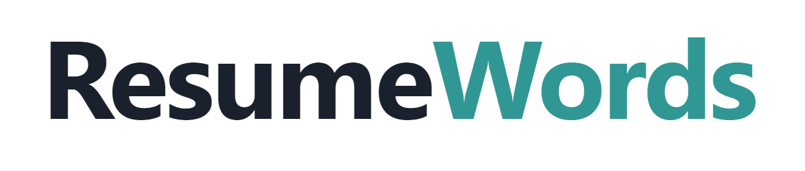
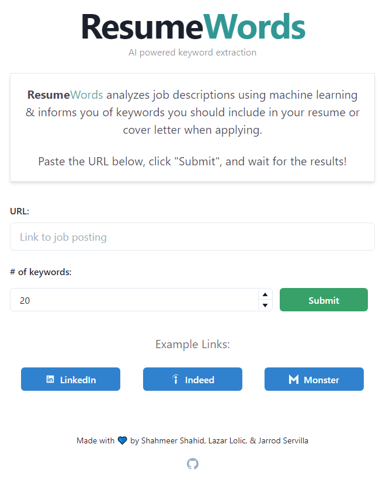

<br />
<p align="center">
  <a href="https://github.com/othneildrew/Best-README-Template">
    
  </a>

  <div align="center">

[![Contributors][contributors-shield]][contributors-url]
[![Forks][forks-shield]][forks-url]
[![Stargazers][stars-shield]][stars-url]
[![Issues][issues-shield]][issues-url]
[![MIT License][license-shield]][license-url]

</div>

  <h2 align="center">ResumeWords</h2>

  <p align="center">
    Nail your resume and cover letter by leveraging AI and NLP to extract keywords from online job postings.
    <br />
    <a href="https://resume-words.com">View Demo</a>
    ·
    <a href="https://github.com/ShahmeerShahid/ResumeWords/issues">Report Bug</a>
    ·
    <a href="https://github.com/ShahmeerShahid/ResumeWords/issues">Request Feature</a>
  </p>
</p>

<!-- TABLE OF CONTENTS -->
<details open="open">
  <summary>Table of Contents</summary>
  <ol>
    <li>
      <a href="#about-the-project">About The Project</a>
      <ul>
        <li><a href="#built-with">Built With</a></li>
      </ul>
    </li>
    <li>
      <a href="#getting-started">Getting Started</a>
      <ul>
        <li><a href="#prerequisites">Prerequisites</a></li>
        <li><a href="#installation">Installation</a></li>
      </ul>
    </li>
    <li><a href="#usage">Usage</a></li>
    <li><a href="#roadmap">Roadmap</a></li>
    <li><a href="#license">License</a></li>
    <li><a href="#contact">Contact</a></li>
  </ol>
</details>

<!-- ABOUT THE PROJECT -->

## About The Project

<div align="center">
    
</div>
<!-- [![Product Name Screen Shot][product-screenshot]]() -->

The job search process can be very difficult, especially with Covid-19's impact on the economy. That's why its more important than ever to nail your resume and cover letter. That's why we created [ResumeWords](https://resume-words.com). This website uses NLP and AI, coupled with webscraping, to extract keywords from online job postings. Using the right keywords can play a large role in getting your resume shortlisted, so make sure you use them in your resume and cover letter when applying!

### Built With

This project consists of multiple Dockerized microservices which are individually deployed on Google Cloud Platform with CI/CD.

Services:

-   API Gateway
-   Linkedin webscraper
-   Indeed webscraper
-   Monster webscraper
-   NLP machine learning model service

The frontend is a static site, built with React and deployed using Firebase.

<!-- GETTING STARTED -->

## Getting Started

This is an example of how you may give instructions on setting up your project locally.
To get a local copy up and running follow these simple example steps.

### Prerequisites

-   Docker
-   NPM (frontend)

### Installation

To spin up the microservices:

```sh
docker-compose up
```

To test the frontend:

```sh
cd frontend-website
npm start
```

<!-- USAGE EXAMPLES -->

## Usage

Paste a link for any job posting from LinkedIn, Indeed, or Monster. Next, select a number of words and click submit. We'll scrape the job description from the website and analyze the resulting text with our pre-trained NLP model to return a list of keywords and their corresponding [TF/IDF](https://github.com/ShahmeerShahid/KeywordFinder-NLP_Model) scores. Clicking on a keyword will take you to a thesaurus entry for the word.

<div align="center">
    
</div>

<!-- ROADMAP -->

## Roadmap

Proposed future features:

-   Support for more job posting platforms.
-   Option to paste a job description (instead of a link) for analysis.
-   Chrome extension to scan the job posting page directly.

<!-- LICENSE -->

## License

Distributed under the MIT License. See `LICENSE` for more information.

<!-- CONTACT -->

## Contact

[Shahmeer Shahid](https://www.linkedin.com/in/shahmeer-shahid/) - shahmeer800@gmail.com

[Lazar Lolic](https://www.linkedin.com/in/lazar-lolic-207779184/) - lazarlolic12@gmail.com

[Jarrod Servilla](https://www.linkedin.com/in/jarrod-servilla/) - jarrod.servilla@gmail.com

<!-- MARKDOWN LINKS & IMAGES -->
<!-- https://www.markdownguide.org/basic-syntax/#reference-style-links -->

[contributors-shield]: https://img.shields.io/github/contributors/ShahmeerShahid/ResumeWords
[contributors-url]: https://github.com/ShahmeerShahid/ResumeWords/graphs/contributors
[forks-shield]: https://img.shields.io/github/forks/ShahmeerShahid/ResumeWords
[forks-url]: https://github.com/ShahmeerShahid/ResumeWords/network/members
[stars-shield]: https://img.shields.io/github/stars/ShahmeerShahid/ResumeWords
[stars-url]: https://github.com/ShahmeerShahid/ResumeWords/stargazers
[issues-shield]: https://img.shields.io/github/issues/ShahmeerShahid/ResumeWords
[issues-url]: https://github.com/ShahmeerShahid/ResumeWords/issues
[license-shield]: https://img.shields.io/github/license/ShahmeerShahid/ResumeWords
[license-url]: https://github.com/ShahmeerShahid/ResumeWords/blob/master/LICENSE
[product-screenshot]: images/screenshot.png
